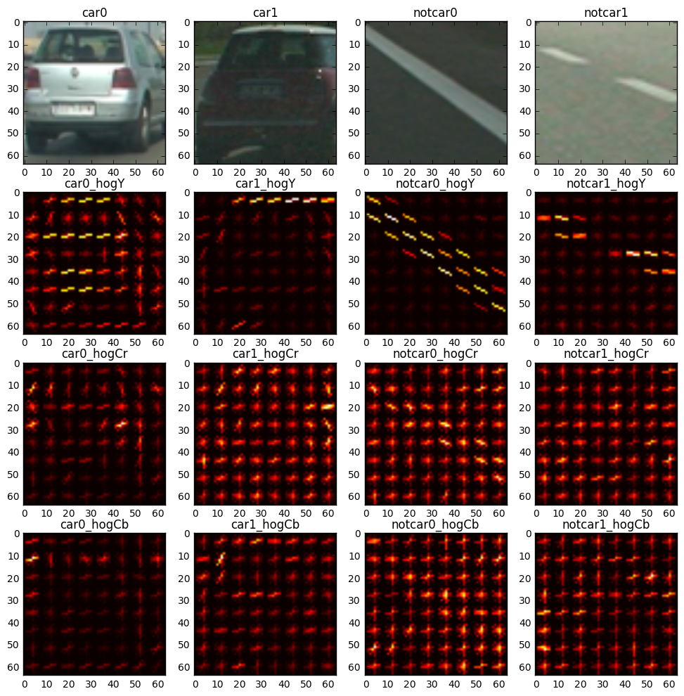
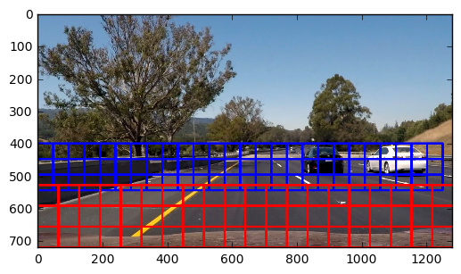
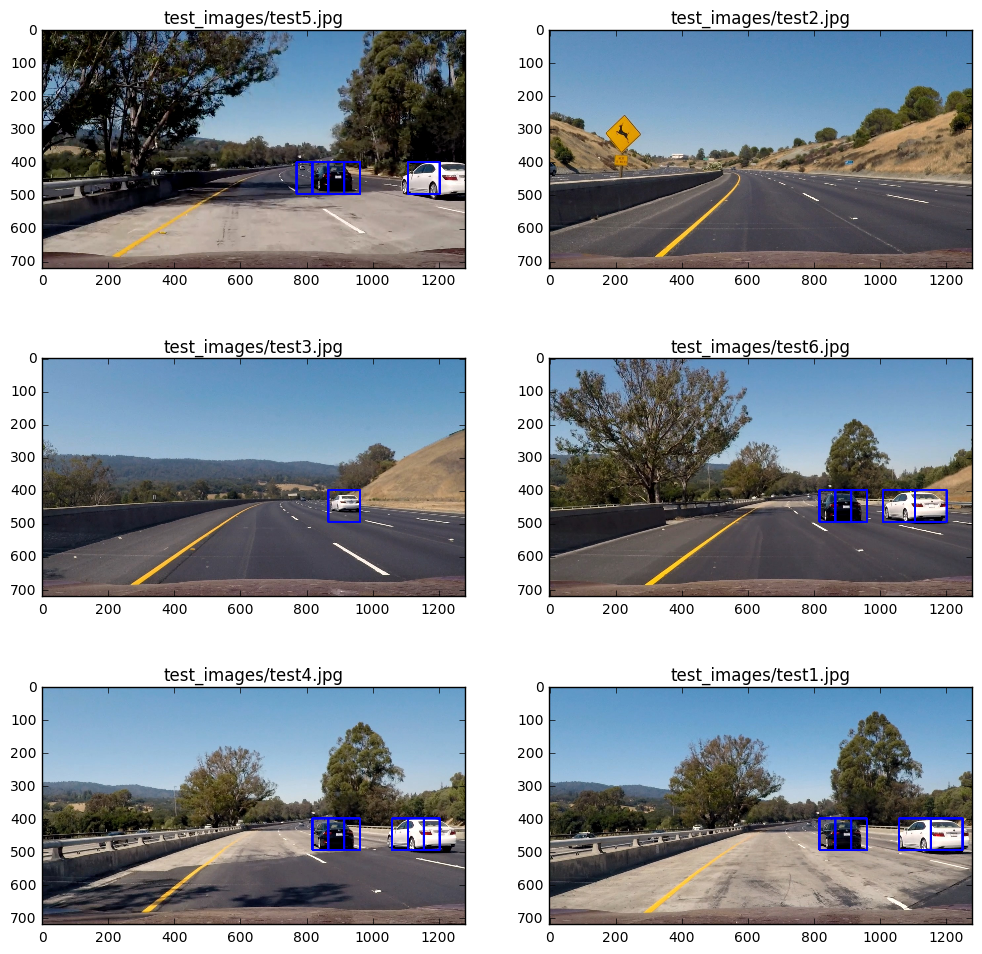

##Vehicle detection and bounding boxes

The goals of this project are as following:
* Perform feature extraction (HOG, color etc.) on a labeled training set of images and train a classifier
* Implement a sliding-window technique and use the trained classifier to search for vehicles in test images
* Run image pipeline on a video stream, create a heat map of recurring detections frame by frame to reject outliers
* Estimate and draw a bounding box for each vehicle detected in the video

###Histogram of Oriented Gradients (HOG)

####1. Explain how (and identify where in your code) you extracted HOG features from the training images.

Udacity provided a set of `vehicle` and `non-vehicle` images as training dataset for this project.  Here are couple of examples of each of the `vehicle` and `non-vehicle` classes:


The training data had 64x64x3 cutout images with 8792 car images and 8968 non-car images. Number of car and non-car images were roughly equal, so there was no need to do any furhter class balancing. The next step was to identify a set of features that would serve well for the classification task of identifying presence of a car in any 64x64x3 image. Histogram of Oriented Gradients (HOG) is one such feature, which has proven to be very useful in detecting objects of distinct shapes. So, HOG was one obvious choice for the set of features. The parameters of HOG are `orientations`, `pixels per cells`, `cells per block`, and the `channels` of the `color space` on which to calculate HOG. I tried a few combinations of these parameters and finally settled down to the following values ([train.py](train.py) lines 28-32):
```python
orient = 9  # HOG orientations
pix_per_cell = 8 # HOG pixels per cell
cell_per_block = 2 # HOG cells per block
color_space = 'YCrCb' # Can be RGB, HSV, LUV, HLS, YUV, YCrCb
hog_channel = "ALL" # Can be 0, 1, 2, or "ALL"
```
The parameter `orient` represents the number of orientation bins for the gradient histogram. Value of 9 is a good balance between the processing time and finer details of orientation. Intuitively, the parameter `pix_per_cell` is chosen to cover the smaller sized features e.g. tail lights and `cell_per_block` are chosen to cover larger sized features such as windows and wheels.  I tried different color spaces such as RGB, HSV etc. but got the best training results (99.3% validation accuracy) using color space of YCrCb and with all three channels for computing HOG. Here is a visualization of the HOG parameters selected as above, for car and non-car images:

###Training Process 
Apart from HOG, I also added spatial features and color histogram features to the feature vector going into the classifier ([train.py](train.py) lines 33-37). Udacity provided us with a few helper functions which are captured in [vd_functions.py](vd_functions.py). I used the `extract_features()` function to extract the above selected features for the list of car and non-car images.
```python
car_features = extract_features(cars, color_space=color_space, 
                        spatial_size=spatial_size, hist_bins=hist_bins, 
                        orient=orient, pix_per_cell=pix_per_cell, 
                        cell_per_block=cell_per_block, 
                        hog_channel=hog_channel, spatial_feat=spatial_feat, 
                        hist_feat=hist_feat, hog_feat=hog_feat)
notcar_features = extract_features(notcars, color_space=color_space, 
                        spatial_size=spatial_size, hist_bins=hist_bins, 
                        orient=orient, pix_per_cell=pix_per_cell, 
                        cell_per_block=cell_per_block, 
                        hog_channel=hog_channel, spatial_feat=spatial_feat, 
                        hist_feat=hist_feat, hog_feat=hog_feat)
```
The extracted features were then standardized (for making them zero mean and unit variance, across features) using sklearn.preprocessing `StandardScaler()` function:
```python
X = np.vstack((car_features, notcar_features)).astype(np.float64)                        
# Fit a per-column scaler
X_scaler = StandardScaler().fit(X)
# Apply the scaler to X
scaled_X = X_scaler.transform(X)
```
After scaling the features, the next step was to split the labeled dataset into training and validation, using sklearn.model_selection `train_test_split()` function:
```python
# Define the labels vector
y = np.hstack((np.ones(len(car_features)), np.zeros(len(notcar_features))))
# Split up data into randomized training and test sets
rand_state = np.random.randint(0, 100)
X_train, X_test, y_train, y_test = train_test_split(scaled_X, y, test_size=0.2, random_state=rand_state)
```
The final step in training is to identify a classifer and train it. I selected sklearn.svm `LinearSVC()` as the classifier and trained it using the data prepared as above.
```python
# Use a linear SVC 
svc = LinearSVC()
svc.fit(X_train, y_train)
# Check the score of the SVC
print('Test Accuracy of SVC = ', round(svc.score(X_test, y_test), 4))
```
After running the above training process using [train.py](train.py), the result of training is as follows:
```
$ python train.py
Number of car images: 8792   Number of non-car images: 8968
Using: 9 orientations 8 pixels per cell and 2 cells per block
Feature vector length: 6108
Test Accuracy of SVC =  0.993
```
The training results of classifer, scaler, and training parameters were saved in a pickle file for later use during inference (lines 74-88 of [train.py](train.py))

###Sliding Window Search

####1. Describe how (and identify where in your code) you implemented a sliding window search.  How did you decide what scales to search and how much to overlap windows?
Identifying the region and sizes of sliding windows to search for cars was a critical task in this project. The right choices would lead to less false positives and be able to track vehicles better. Couple of observations while looking at the test_images:
* We could limit the search region to below the horizon 
* The cars closer to the ego vehicle are bigger in size, compared to cars further away

With the above observations, I decided to use two different window sizes. I eventually settled on 128x128 for the cars closer, and 96x96 for the cars further away. These sizes were chosen based upon the observation of test images, and trying different sizes on test_images. I chose the overlap of 0.5 for both x and y directions. These choices for the sliding window search are implemented in [video.py](video.py) lines 20-26, inside the `get_heat()` function. Below is a visualization of the search windows, where red windows show 128x18 closer windows and blue windows show 96x96 far windows. 



####2. Show some examples of test images to demonstrate how your pipeline is working.  What did you do to optimize the performance of your classifier?

Various parameters of the classifer and sliding window search were tweaked to eventually get a satisfiable result on the test images. Some of the experiemnts that I tried are:
* Different color spaces
* Different color channels for HOG
* Adding spatial features and color histogram features
* Different spatial sizes and histogram bin sizes
* Different sliding window approaches and sizes

Result of drawing the "hot windows" on test_images, with my final chosen method:



###Video Implementation
####1. Provide a link to your final video output
I have added the result of my video pipeline [video.py](video.py) after running it on project_video.mp4 to this github repo. The link is: [project_output.mp4](project_output.mp4)
####2. Describe how (and identify where in your code) you implemented some kind of filter for false positives and some method for combining overlapping bounding boxes


