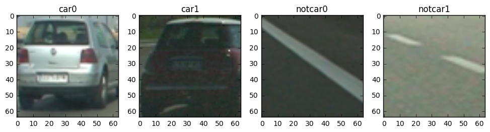

##Vehicle detection and bounding boxes

The goals of this project are as following:
* Perform feature extraction (HOG, color etc.) on a labeled training set of images and train a classifier
* Implement a sliding-window technique and use the trained classifier to search for vehicles in test images
* Run image pipeline on a video stream, create a heat map of recurring detections frame by frame to reject outliers
* Estimate and draw a bounding box for each vehicle detected in the video

###Histogram of Oriented Gradients (HOG)

####1. Explain how (and identify where in your code) you extracted HOG features from the training images.

Udacity provided a set of `vehicle` and `non-vehicle` images as training dataset for this project.  Here are example imagesof one of each of the `vehicle` and `non-vehicle` classes:

